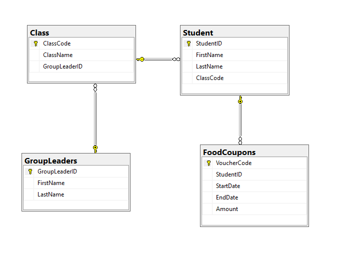

# School Management System Database Model

This repository contains the database design for a simple school management system. The design is intended to manage classes, their assigned group leaders, the students enrolled in those classes, and a system for tracking food coupons issued to students.

## Class Diagram

  

This Entity Relationship Diagram (ERD) illustrates the relationships between the core entities in our school management system:

- **Classes:** The fundamental unit of organization, where students are grouped for instruction.
- **Group Leaders:** Teachers or instructors responsible for managing and leading a specific class.
- **Students:** Individuals enrolled in the school and assigned to classes.
- **Food Coupons:** Vouchers provided to students that can be redeemed for meals or snacks.

The diagram shows that each class can have one group leader, and a group leader can lead multiple classes. Each class can have multiple students, but each student belongs to only one class. Additionally, each student can have multiple food coupons.

## Database Diagrams

These diagrams provide a more detailed view of the database structure, including:

- **Tables:** The individual structures that hold the data for each entity (e.g., Class, GroupLeader, Student, FoodCoupon).
- **Columns:** The specific attributes or fields within each table (e.g., ClassName, GroupLeaderID, FirstName, LastName, StartDate, EndDate).
- **Constraints:** Rules that ensure data integrity and consistency (e.g., primary keys, foreign keys, unique constraints).
